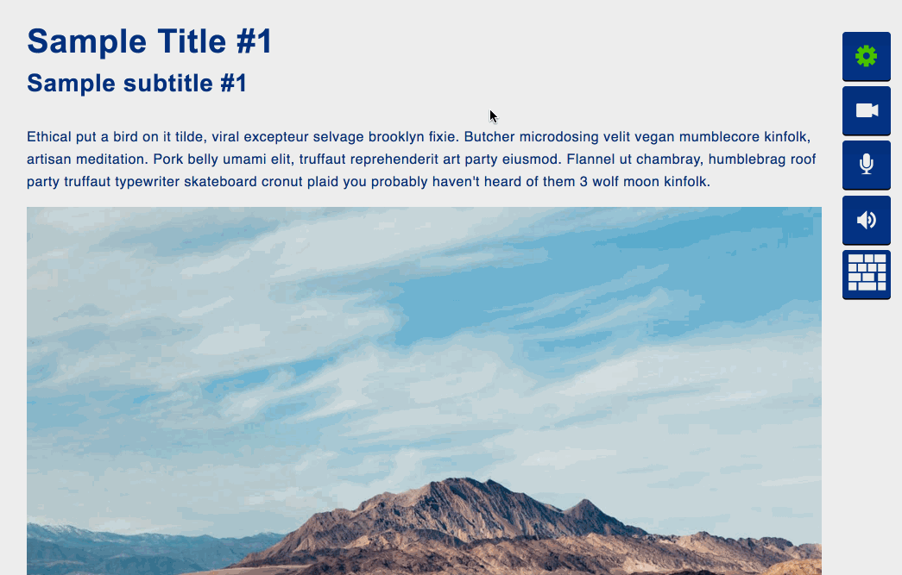

# Keller Library

A library that transforms every website to its accessible version just with inclusion of several HTML attributes. **Supports navigation by voice, keyboard and gamepad.** Content on the website can be delivered by the speech generator feature.

## Demo

## Installation

	$ npm i

## Usage

Run `$ grunt` and open `http://localhost:9000/demo/index.hmtl` in the browser

## Build

	$ grunt

| Option       | Description                                                          |
|--------------|----------------------------------------------------------------------|
| `watch`      | Starts a live server and watches all assets (default port 9000).     |
| `lint`       | Runs code checks on JS files.                                        |
| `build`      | Minifies all the assets.                                             |
| `test`       | Runs unit and functional tests                                       |

## Navigation options

Currently developed navigation options:
* mouse click
* keyboard event
* gamepad event
* voice commands

## Browser support

Chrome 33+, Firefox 44+, IE 9+, Safari 5.1+

## Gamepad navigation support

Different gamepad devices have varying support across platforms. The best overall is to get a Wired Xbox 360 Controller. It works out of the box on Windows XP, Windows Vista, Windows 7, and popular Linux distributions. On Mac OS X, it first requires a [driver to be installed][driver], but works fine.

  [driver]: http://tattiebogle.net/index.php/ProjectRoot/Xbox360Controller/OsxDriver

## Background idea

In 2016 285 million people are estimated to be visually impaired worldwide: 39 million are blind and 246 have low vision. Despite their visual impairments, many of those people use the Internet every day, just like you and me. Further, as more and more people over the age of 50 become comfortable with technology, Internet usage among this demographic will only increase in coming years.

The web is full of tips on how to design websites for blind users, most of which are geared toward making your website accessible to screen readers. But as you can tell by looking at the numbers above, there is a large middle ground. The vast majority of individuals with visual impairments, even those considered legally blind, don't need or use screen-reading software. However, the web can still be a difficult and cumbersome place to navigate when one can't quite see it clearly.

The idea behind this project is to develop a free and easy to install tool that will help the beforementioned people to access as much of the internet content as possible.
